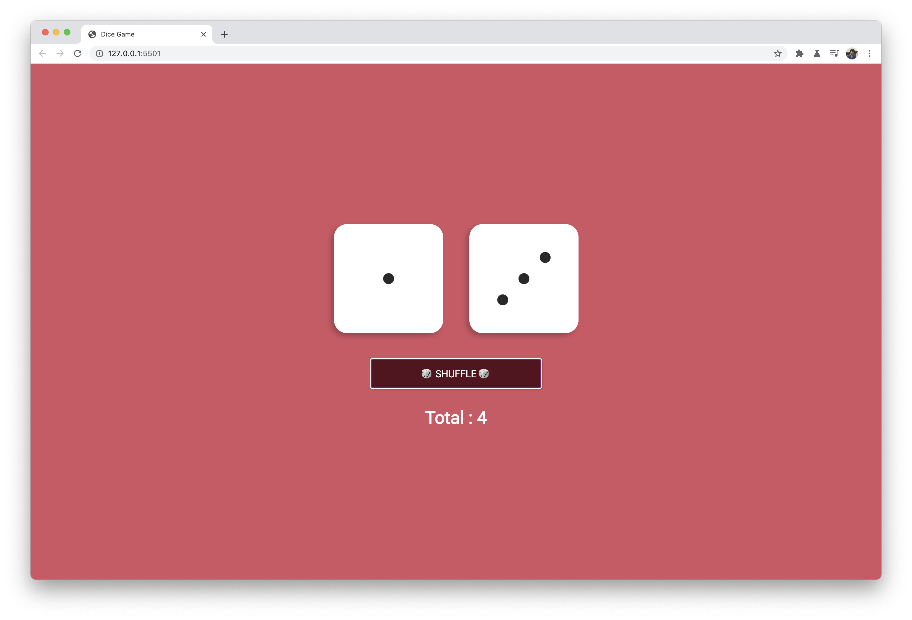

# Dice Shuffle
## Some Steps
1. Create html css js files, link and check setup
2. Write basic CSS for dice
3. Write JS function `reset` to generate random numbers and calculate total, set the numbers in dice using DOM.
4. Event listener on button, call `reset`
5. Call `reset` on page load.

# Style Guide
- Background color: rgba(192, 10, 46, 0.753);
- Button background: #56101e;